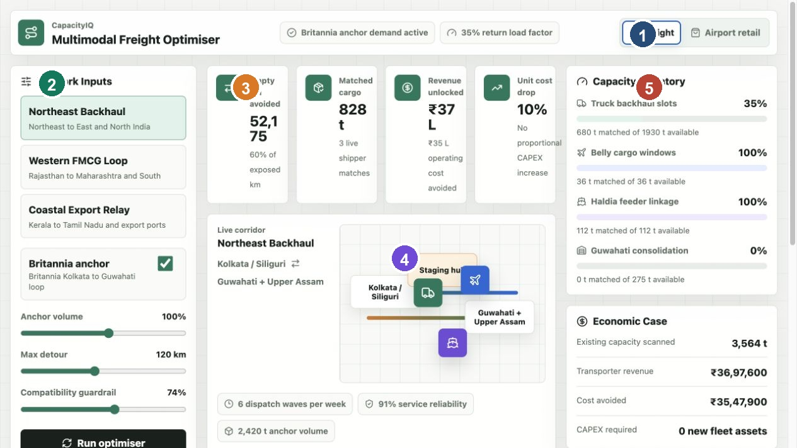
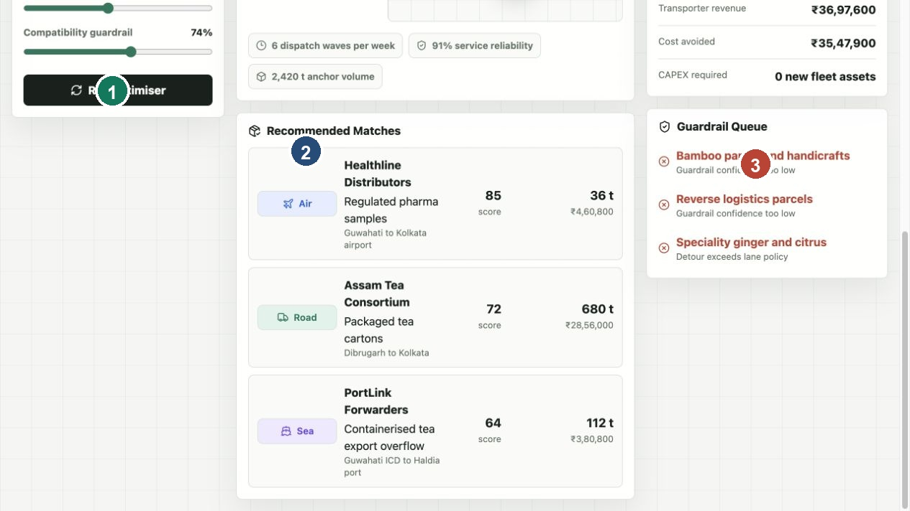
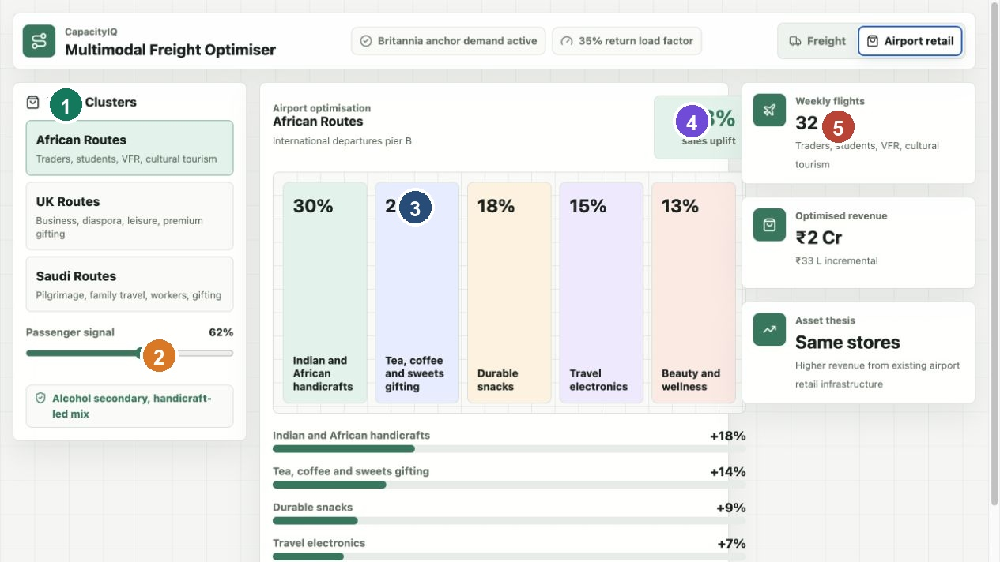

# CapacityIQ Freight And Capacity Optimiser

CapacityIQ is a local full-stack prototype for an AI-powered freight and capacity optimisation marketplace. It demonstrates how shippers, transporters, air cargo capacity, sea freight capacity, and staging hubs can be matched so existing assets work harder before new assets are purchased.

The freight example uses Britannia as the anchor demand partner. Britannia creates predictable base movement into a corridor. The platform then looks for compatible third-party cargo that can use empty or underused return capacity. The same optimisation idea is also shown for airport retail, where passenger and route signals change product allocation inside existing shop space.

## What The Application Does

The application has two workspaces.

| Workspace | Purpose | Main Output |
| --- | --- | --- |
| Freight Optimisation | Match cargo demand with unused road, air, sea, and staging capacity | Empty kilometres avoided, matched cargo, unlocked revenue, load factor, and guardrail queue |
| Airport Retail Optimisation | Match product mix with passenger route demand | Product allocation, uplift estimate, optimised revenue, and store productivity message |

The core thesis is simple:

> Do not buy more assets first. Use existing assets more intelligently.

## Screenshots

### Freight Workspace



| Marker | Area | What It Does |
| --- | --- | --- |
| 1 | Workspace tabs | Switch between Freight and Airport retail views |
| 2 | Network inputs | Choose corridor, anchor demand, detour policy, and guardrail strictness |
| 3 | Key result cards | Show empty kilometres avoided, matched cargo, revenue, and unit cost impact |
| 4 | Live corridor map | Show the selected corridor and multimodal movement pattern |
| 5 | Capacity and economics rail | Show mode utilisation, savings, capacity, and review queue |

### Recommended Matches



| Marker | Area | What It Does |
| --- | --- | --- |
| 1 | Run optimiser | Applies the visible network inputs and requests a backend optimisation run |
| 2 | Recommended Matches | Shows the strongest cargo matches from the active dataset |
| 3 | Guardrail Queue | Shows shipments rejected or flagged for review |

### Airport Retail Workspace



| Marker | Area | What It Does |
| --- | --- | --- |
| 1 | Route clusters | Selects the passenger route group |
| 2 | Passenger signal slider | Models stronger or weaker demand |
| 3 | Product allocation board | Shows how store space should be assigned |
| 4 | Sales uplift | Shows expected uplift from better assortment matching |
| 5 | Retail metrics | Shows flights, revenue, and asset productivity |

## Local Setup

Clone the project into any folder on your machine or server:

```bash
git clone https://github.com/Rump-Labs/RouteFlow.git
cd RouteFlow
```

Run the full local stack:

```bash
npm install
npm run dev
```

Then open:

```bash
http://localhost:3000/
```

The `npm run dev` command starts both:

| Service | URL | Purpose |
| --- | --- | --- |
| Frontend | `http://localhost:3000/` | React dashboard |
| Backend | `http://127.0.0.1:8000/` | CSV-backed API and optimiser |

### Why The Browser URL Stays On Port 3000

The browser address bar shows the frontend route, so it normally stays at:

```bash
http://localhost:3000/
```

That does not mean the backend is unused. The React app calls the backend in the background using `fetch()`. These API calls do not navigate the browser to a new page, so the address bar does not change.

When the backend is running, the top status bar shows:

```text
Backend optimiser active
```

The app uses these backend calls:

| Frontend Action | Backend Call |
| --- | --- |
| App loads | `GET http://127.0.0.1:8000/api/corridors` |
| App loads | `GET http://127.0.0.1:8000/api/retail-profiles` |
| App loads | `GET http://127.0.0.1:8000/api/health` |
| Select Run optimiser after changing freight inputs | `POST http://127.0.0.1:8000/api/optimise` |

You can also verify this in the browser developer tools under the Network tab, or by opening the backend health endpoint directly:

```bash
http://127.0.0.1:8000/api/health
```

## Other Useful Commands

| Command | Purpose |
| --- | --- |
| `npm run dev` | Start backend and frontend together |
| `npm run dev:backend` | Start only the Python backend on port `8000` |
| `npm run dev:frontend -- --host localhost --port 3000` | Start only the frontend on port `3000` |
| `npm run seed:data` | Regenerate the dummy CSV dataset |
| `npm run test:backend` | Run backend dataset and optimiser tests |
| `npm run lint` | Run frontend lint checks |
| `npm run build` | Build the frontend |

## Technology Stack

| Layer | Language Or Tool | Why It Was Used |
| --- | --- | --- |
| Frontend UI | React 19 with TypeScript and TSX | Best fit for interactive dashboards with sliders, tabs, cards, and fast state updates |
| Frontend runtime | Vinext and Vite | Local development server, build pipeline, and fast refresh |
| Styling | CSS with Tailwind import | Full dashboard layout, responsive behaviour, cards, buttons, route map, and sliders |
| Icons | lucide-react | Clean interface icons for transport, metrics, controls, and retail |
| Backend API | Python standard library HTTP server | Easy to run locally without installing extra Python packages |
| Data storage | CSV files | Simple table format that business and data teams can inspect or replace |
| Package scripts | Node.js and npm | Single command workflow for local development and verification |

React and TypeScript are used for the visible application because this is a dashboard-heavy product. Python is used for the backend because optimisation, routing, forecasting, and data processing are natural Python workloads.

## Backend Dataset

The backend uses dummy CSV data in `backend/data`. The dataset is intentionally large enough to feel like a real pilot instead of a tiny mockup.

| CSV Table | Rows | Purpose |
| --- | ---: | --- |
| `corridors.csv` | 12 | Freight corridors and anchor movement assumptions |
| `capacity.csv` | 48 | Road, air, sea, and staging capacity by corridor |
| `shipments.csv` | 2,400 | Candidate cargo loads to match into available capacity |
| `hubs.csv` | 42 | Staging hubs, docks, cold capacity, and reliability |
| `partners.csv` | 144 | Transporters, air cargo partners, warehouses, and 3PLs |
| `retail_profiles.csv` | 8 | Airport route clusters and revenue assumptions |
| `retail_assortments.csv` | 40 | Product allocation and uplift assumptions by route cluster |

Regenerate the dataset:

```bash
npm run seed:data
```

The seed script is deterministic, so the same command produces repeatable data.

## Backend API

Start the backend:

```bash
npm run dev:backend
```

Health check:

```bash
curl http://127.0.0.1:8000/api/health
```

### Endpoints

| Method | Endpoint | Purpose |
| --- | --- | --- |
| `GET` | `/api/health` | Service status, dataset counts, and available endpoints |
| `GET` | `/api/tables` | Row counts and total capacity across CSV tables |
| `GET` | `/api/corridors` | All corridors with nested capacity and shipment rows |
| `GET` | `/api/corridors/{id}` | One corridor with nested capacity and shipments |
| `GET` | `/api/shipments?corridor_id=northeast&limit=50` | Paginated shipment rows |
| `GET` | `/api/capacity?corridor_id=northeast` | Capacity rows for one or all corridors |
| `GET` | `/api/retail-profiles` | Airport retail route profiles and assortment rules |
| `GET` | `/api/hubs?limit=50` | Hub table rows |
| `GET` | `/api/partners?limit=50` | Partner table rows |
| `POST` | `/api/optimise` | Run the backend freight optimiser |
| `POST` | `/api/optimize` | Same as `/api/optimise` for US spelling |

### Optimiser Request Example

```bash
curl -X POST http://127.0.0.1:8000/api/optimise \
  -H 'Content-Type: application/json' \
  -d '{
    "corridorId": "northeast",
    "anchorEnabled": true,
    "anchorMultiplier": 1,
    "maxDetour": 120,
    "guardrail": 74
  }'
```

### Optimiser Response Shape

The optimiser returns:

| Field | Meaning |
| --- | --- |
| `accepted` | Shipments accepted into capacity |
| `declined` | Shipments rejected or queued for review |
| `recommendedActions` | Business-readable instructions showing what cargo to move, by which mode, through which route sequence, and why |
| `remaining` | Remaining tonnes by mode |
| `modeUtilisation` | Used, remaining, and utilisation by mode |
| `bookableTonnes` | Tonnes the optimiser is allowed to allocate after operating reserve |
| `reserveTonnes` | Capacity held back for service reliability, slot risk, and operational buffer |
| `matchedTonnes` | Total tonnes matched |
| `revenue` | Estimated revenue unlocked |
| `emptyKmAvoided` | Empty kilometres avoided |
| `costSaved` | Operating cost avoided |
| `loadFactor` | Return capacity load factor |
| `unitCostDrop` | Estimated freight unit cost reduction |
| `anchorTonnes` | Anchor demand volume used in the optimiser run |

## How The App Recommends Routes, Products, And Quantity

The app no longer stops at KPI numbers. Each backend optimisation run also creates an Action Recommendations panel. This panel converts the accepted shipment matches into plain operating instructions.

For every recommended move, the backend decides:

| Decision | How It Is Calculated |
| --- | --- |
| What product or cargo should move | Selects the accepted shipment with the best combination of compatibility score, demand priority, revenue, detour feasibility, and available mode capacity |
| How much should move | Uses the matched tonnes actually accepted into bookable capacity after reserve capacity is held back |
| Which mode should carry it | Uses the shipment mode that passed capacity and guardrail checks: road, air, sea, or staging |
| Which route should be followed | Builds a corridor-aware route sequence from shipment origin, corridor nodes, and shipment destination |
| Why the recommendation is useful | Explains compatibility, revenue, empty kilometres avoided, and capacity share in simple language |

Example recommendation:

```text
Move 26 t of packaged food by road
Route: Dibrugarh -> Guwahati -> Siliguri -> Kolkata
Instruction: Assign this load to a return truck lane within the detour policy.
Why: Strong compatibility, clear backhaul fit, meaningful revenue, and reduced empty kilometres.
```

This is still a prototype engine. In production, the same contract can be connected to live GPS, transporter availability, TMS bookings, airline cargo schedules, port slots, toll data, weather, and a formal optimisation solver.

## Optimiser Calculation Formulas

When the user selects Run optimiser, the frontend sends the active corridor and scenario inputs to `/api/optimise`. The backend calculates capacity, shipment scores, accepted matches, KPI cards, mode utilisation, and recommended actions with the formulas below.

### Scenario And Capacity

| Parameter | Formula |
| --- | --- |
| `anchorFactor` | `anchorMultiplier` when Britannia anchor is enabled, otherwise `0.54` |
| `availableCapacity` | `capacity * (availablePercent / 100) * anchorFactor` |
| `bookableCapacity` | `availableCapacity * modeTargetFill` |
| `reserveTonnes` | `availableCapacity - bookableCapacity` |

Mode target fill values keep a practical operating buffer instead of allowing every mode to show 100% utilisation.

| Mode | Target Fill |
| --- | ---: |
| `road` | `0.93` |
| `air` | `0.84` |
| `sea` | `0.78` |
| `staging` | `0.88` |

### Shipment Scoring

Each shipment receives a score before capacity is allocated.

| Component | Formula |
| --- | --- |
| `routeFit` | `max(0, 1 - detourKm / max(maxDetour, 1))` |
| `reliabilityFit` | `reliability / 100` |
| `revenueFit` | `min(revenuePerTon / 12000, 1)` |
| `urgencyFit` | `urgency / 100` |
| `compatibilityFit` | Value from the compatibility table below |
| `guardrailPenalty` | `((guardrail - 50) / 50) * (1 - compatibilityFit) * 22` |
| `score` | `round(routeFit * 32 + reliabilityFit * 24 + compatibilityFit * 22 + revenueFit * 15 + urgencyFit * 7 - guardrailPenalty)` |

Compatibility fit values:

| Cargo Compatibility | Fit Value |
| --- | ---: |
| `ambient` | `1.00` |
| `dry` | `1.00` |
| `fragile` | `0.86` |
| `regulated` | `0.74` |
| `chilled` | `0.42` |

### Acceptance Rules

| Rule | Formula Or Condition |
| --- | --- |
| Minimum acceptance score | `threshold = max(55, guardrail - 12)` |
| Capacity check | Reject if no bookable capacity remains in the shipment mode |
| Detour check | Reject non-air shipments when `detourKm > maxDetour` |
| Score check | Reject when `score < threshold` |
| Strict guardrail check | Reject `chilled` or `regulated` cargo when `guardrail >= 82` |

Accepted shipments are processed from highest score to lowest score. A shipment can be fully matched or partially matched depending on the bookable capacity left in its mode.

### Allocation And KPI Cards

| Output | Formula |
| --- | --- |
| `matchedTonnes` per shipment | `min(shipmentTonnes, remainingBookableCapacityForMode)` |
| `adjustedCapacity` | `sum(availableCapacity across all modes)` |
| `totalMatchedTonnes` | `sum(matchedTonnes for accepted shipments)` |
| `revenue` | `sum(matchedTonnes * revenuePerTon)` |
| `emptyKmAvoided` | `round(sum((matchedTonnes / vehicleEquivalentTonnes) * max(120, distanceKm - detourKm)))` |
| `vehicleEquivalentTonnes` | `16` for road, `24` for air, sea, or staging |
| `costSaved` | `emptyKmAvoided * 68` |
| `loadFactor` | `round(totalMatchedTonnes / adjustedCapacity * 100)` |
| `baselineLoadFactor` | `19` when anchor is enabled, otherwise `11` |
| `unitCostDrop` | `max(0, min(34, round((loadFactor - baselineLoadFactor) * 0.62)))` |
| `anchorTonnes` | `round(baseAnchorTonnes * anchorFactor)` |

### Mode Utilisation

| Output | Formula |
| --- | --- |
| `usedTonnes` | `bookableCapacity - remainingBookableCapacity` |
| `remainingTonnes` | `availableCapacity - usedTonnes` |
| `reserveTonnes` | `availableCapacity - bookableCapacity` |
| `utilisation` | `round(usedTonnes / availableCapacity * 100)` |

### Recommended Action Metrics

| Output | Formula |
| --- | --- |
| `actionRevenue` | `matchedTonnes * revenuePerTon` |
| `actionEmptyKmAvoided` | `round((matchedTonnes / vehicleEquivalentTonnes) * max(120, distanceKm - detourKm))` |
| `capacityShare` | `round(matchedTonnes / availableCapacityForMode * 100)` |
| `routeText` | Corridor-aware route nodes joined with `->` |

## Frontend Data Flow

The frontend starts with embedded sample data so the app can still open if the backend is not running. When the backend is available, the app fetches:

1. `/api/corridors`
2. `/api/retail-profiles`
3. `/api/health`

After loading succeeds, the top status bar shows the CSV shipment count. Freight controls act as draft network inputs. When the user selects Run optimiser, the frontend posts the visible corridor, anchor, detour, and guardrail settings to `/api/optimise`. The backend returns the displayed accepted matches, rejected queue, mode utilisation, revenue, empty kilometres avoided, cost saved, load factor, and unit cost impact.

If backend loading or backend optimisation fails, the app displays fallback status text and continues to work with the smaller embedded browser-side model.

Capacity Inventory bars show matched tonnes against operationally available capacity. The backend also keeps mode-specific reserves, so road, air, sea, and staging do not automatically show 100% utilisation just because demand exists.

## Project Architecture

```text
capacityiq-freight-optimizer/
  app/
    page.tsx              Frontend screen orchestration and view layout
    components/
      Metric.tsx          Reusable KPI card component
    data/
      fallback-data.ts    Browser fallback corridors and retail profiles
    lib/
      api.ts              Backend API client functions
      config.ts           Frontend constants and initial network inputs
      formatters.ts       Currency and short-number formatting helpers
      mode-meta.ts        Mode labels, icons, and CSS class names
      optimizer.ts        Browser fallback optimiser
      types.ts            Shared frontend domain types
    layout.tsx            Root app shell and metadata
    globals.css           Dashboard styling and responsive layout
  backend/
    config.py             Backend constants, endpoints, and mode reserve settings
    repository.py         CSV loading and dataset lookup functions
    optimizer.py          Freight scoring and capacity allocation logic
    server.py             Thin local HTTP API entrypoint
    utils.py              Parsing, pagination, and numeric conversion helpers
    test_api.py           Backend tests
    data/
      corridors.csv
      capacity.csv
      shipments.csv
      hubs.csv
      partners.csv
      retail_profiles.csv
      retail_assortments.csv
  docs/
    screenshots/          Annotated screenshots used in this README
  scripts/
    seed_dummy_data.py    Deterministic dummy data generator
    start-local.sh        Starts backend and frontend together
  package.json            npm scripts and frontend dependencies
  vite.config.ts          Frontend build and local dev configuration
  tsconfig.json           TypeScript configuration
```

## Function Call Mapping

### Frontend Functions

| Function Or Object | File | Called By | Purpose |
| --- | --- | --- | --- |
| `Home` | `app/page.tsx` | React page runtime | Owns screen state, loads backend data, chooses Freight or Airport retail view, and renders the dashboard |
| `useEffect(loadBackendData)` | `app/page.tsx` | `Home` | Calls `fetchInitialDashboardData` and stores loaded CSV-backed data |
| `useEffect(loadBackendOptimization)` | `app/page.tsx` | `Home` | Calls `fetchBackendOptimization` for the applied freight inputs |
| `fetchInitialDashboardData` | `app/lib/api.ts` | `Home` | Fetches corridors, retail profiles, and dataset health |
| `fetchBackendOptimization` | `app/lib/api.ts` | `Home` | Posts the applied freight inputs to `/api/optimise` |
| `scoreShipment` | `app/lib/optimizer.ts` | `optimizeCorridor` | Browser fallback scoring only, used if the backend is unavailable |
| `optimizeCorridor` | `app/lib/optimizer.ts` | `Home` through `useMemo` | Browser fallback optimiser only, used if the backend is unavailable |
| `routeNodesFor` | `app/lib/optimizer.ts` | `buildRecommendedActions` | Builds browser fallback route sequences from corridor and shipment fields |
| `instructionFor` | `app/lib/optimizer.ts` | `buildRecommendedActions` | Converts mode and detour policy into a simple operating instruction |
| `buildRecommendedActions` | `app/lib/optimizer.ts` | `optimizeCorridor` | Creates browser fallback action cards when the backend is unavailable |
| `formatCurrency` | `app/lib/formatters.ts` | Metric and row render logic | Formats rupee values in Indian currency style |
| `formatShortCurrency` | `app/lib/formatters.ts` | Metric cards | Shortens currency into lakh and crore labels |
| `Metric` | `app/components/Metric.tsx` | `Home` | Reusable KPI card component |
| `corridors`, `retailProfiles` | `app/data/fallback-data.ts` | `Home` | Local fallback data used when the backend is unavailable |

### Backend Functions

| Function Or Object | File | Called By | Purpose |
| --- | --- | --- | --- |
| `read_csv_table` | `backend/repository.py` | `load_dataset` | Reads a CSV table from `backend/data` |
| `load_dataset` | `backend/repository.py` | Repository startup and tests | Loads all CSV tables and converts them into API-ready objects |
| `score_shipment` | `backend/optimizer.py` | `optimise_corridor` | Scores shipment candidates using the backend version of the scoring logic |
| `route_nodes_for` | `backend/optimizer.py` | `build_recommended_actions` | Builds the recommended route sequence from shipment origin, corridor waypoints, and shipment destination |
| `instruction_for` | `backend/optimizer.py` | `build_recommended_actions` | Creates mode-specific operating instructions for road, air, sea, and staging cargo |
| `build_recommended_actions` | `backend/optimizer.py` | `optimise_corridor` | Converts accepted shipment matches into business-readable action recommendations |
| `optimise_corridor` | `backend/optimizer.py` | `POST /api/optimise` | Accepts, declines, and measures candidate shipments for one corridor |
| `dataset_summary` | `backend/repository.py` | `/api/health` and `/api/tables` | Returns table counts and total scanned capacity |
| `find_corridor` | `backend/repository.py` | Corridor endpoints and optimiser endpoint | Looks up a corridor by ID |
| `CapacityIQHandler.do_GET` | `backend/server.py` | HTTP server | Routes read-only API requests |
| `CapacityIQHandler.do_POST` | `backend/server.py` | HTTP server | Routes optimiser requests |
| `run` | `backend/server.py` | CLI entrypoint | Starts the local backend service |

### Data Generation Functions

| Function | File | Purpose |
| --- | --- | --- |
| `make_capacity_rows` | `scripts/seed_dummy_data.py` | Creates road, air, sea, and staging capacity for every corridor |
| `make_shipments` | `scripts/seed_dummy_data.py` | Creates 2,400 realistic candidate shipment rows |
| `make_hubs` | `scripts/seed_dummy_data.py` | Creates staging and consolidation hub rows |
| `make_partners` | `scripts/seed_dummy_data.py` | Creates transporter, warehouse, shipping, and air cargo partners |
| `make_retail_rows` | `scripts/seed_dummy_data.py` | Creates retail route profiles and assortment tables |

## User Action Mapping

| User Action | Frontend State Or Function | Result |
| --- | --- | --- |
| Select a freight corridor | `setSelectedCorridorId` | Updates the draft corridor input |
| Toggle Britannia anchor | `setAnchorEnabled` | Updates the draft anchor setting |
| Move Anchor volume | `setAnchorMultiplier` | Updates the draft anchor tonnes assumption |
| Move Max detour | `setMaxDetour` | Updates the draft route flexibility policy |
| Move Compatibility guardrail | `setGuardrail` | Updates the draft compatibility threshold |
| Select Run optimiser | `setAppliedNetworkInputs` | Applies the visible draft inputs and requests backend optimisation |
| Switch to Airport retail | `setView` | Shows the retail optimisation workspace |
| Select a retail route cluster | `setSelectedRetailId` | Changes product allocation and passenger profile |
| Move Passenger signal | `setPassengerWave` | Changes sales uplift and optimised revenue estimate |

## Production Extension

The current backend is intentionally simple and local. A production version should add:

| Layer | Suggested Direction |
| --- | --- |
| Database | PostgreSQL or another relational database for shipments, capacity, rates, partners, users, and approvals |
| Backend API | FastAPI or Node.js service with authentication, saved scenarios, booking, pricing, and audit history |
| Optimisation Engine | Python service using OR Tools, Pyomo, or custom solvers for vehicle routing, backhaul matching, multimodal routing, and time windows |
| Forecasting | Demand, capacity, passenger, and disruption forecasting models |
| Integrations | ERP, TMS, WMS, transporter GPS, airline cargo, port systems, POS, and flight schedule APIs |
| Governance | Compatibility rules, food safety, pharma handling, customer approvals, and compliance workflows |

## Verification

The current repository has been checked with:

```bash
npm run test:backend
npm run lint
npm run build
curl http://127.0.0.1:8000/api/tables
curl -I http://localhost:3000/
```

Expected result:

| Check | Expected Outcome |
| --- | --- |
| Backend tests | All tests pass |
| Lint | No lint errors |
| Build | Frontend build completes |
| API tables | JSON table counts are returned |
| Frontend page | HTTP `200 OK` |

## Demo Study Documents

The `docs` folder includes Word documents that can be used for preparation and walkthroughs:

| Document | Purpose |
| --- | --- |
| `docs/CapacityIQ_Study_Guide_FAQ.docx` | One-hour meeting study guide with demo agenda, feature explanation, AI engine explanation, FAQs, and closing talk track |
| `docs/CapacityIQ_Demo_Runbook.docx` | Practical demo walkthrough for operating the local app during a live session |
